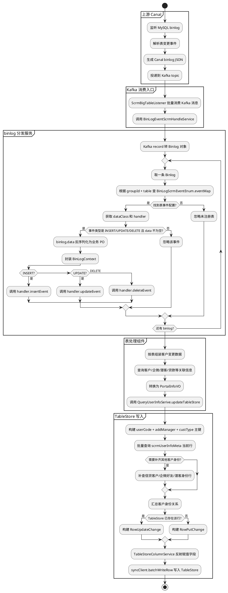

# 客户档案迁移架构、TableStore 宽表模型与数据变动处理思想

## 1. 文档目的

本文基于当前项目代码，梳理客户档案实时同步链路，重点说明：

1. 客户档案迁移 / 同步架构；
2. TableStore 客户宽表数据模型；
3. 数据变动后的核心处理思想。

本文关注链路为：

```text
MySQL 业务表变更
  ↓
Canal 监听 binlog
  ↓
Canal 生产 Kafka 消息
  ↓
finance-data-clearing 消费 Kafka
  ↓
根据表名和消费组路由到处理组件
  ↓
转换、融合、补齐客户身份数据
  ↓
实时写入 TableStore 客户宽表 scrmUserInfoMeta
```

> 说明：当前项目内没有 Canal 服务端监听 MySQL binlog 并生产 Kafka 的实现代码；本项目承担的是 Kafka 消费、binlog 解析、客户宽表更新这部分职责。

---

## 2. 客户档案迁移架构

### 2.1 整体架构

客户档案迁移不是一次性单表搬迁，而是一个面向客户画像的实时宽表同步架构。

上游多个业务库中的客户、企微、潜客、贷款、授信、营销、标签等表发生变化后，由 Canal 捕获 binlog 并写入 Kafka。本项目消费这些 Kafka 消息，将不同表的变更统一归并到 TableStore 宽表 `scrmUserInfoMeta`。

```text
┌──────────────┐
│ MySQL 业务库  │
│ 客户/企微/贷款 │
└──────┬───────┘
       │ binlog
       ▼
┌──────────────┐
│    Canal      │
│ 监听并解析变更 │
└──────┬───────┘
       │ JSON 消息
       ▼
┌──────────────┐
│    Kafka      │
│ scrm/cust/... │
└──────┬───────┘
       │ batch consume
       ▼
┌──────────────────────────────┐
│ finance-data-clearing         │
│ Kafka Listener                │
│ BinLogEventScrmHandleService  │
│ BinLogScrmEventEnum 路由表     │
└──────┬───────────────────────┘
       │ handler
       ▼
┌──────────────────────────────┐
│ 各表 Component                │
│ ScrmCustInfoComponent         │
│ ScrmWechatBindCustComponent   │
│ WechatFollowUpComponent       │
│ ScrmLmLoanComponent 等         │
└──────┬───────────────────────┘
       │ PortalInfoVO
       ▼
┌──────────────────────────────┐
│ TableStore                    │
│ scrmUserInfoMeta 客户宽表      │
└──────────────────────────────┘
```

### 2.2 上游 Canal 与 Kafka 消息

Canal 捕获 MySQL binlog 后，生产到 Kafka 的消息在本项目中被解析为 `Binlog` 对象。

`Binlog` 关键字段包括：

| 字段 | 含义 |
|---|---|
| `data` | 变更后的数据列表，项目会将其反序列化为对应 PO |
| `old` | 更新前的旧值，当前通用处理链路主要使用 `data` |
| `database` | 数据库名 |
| `table` | 发生变更的表名 |
| `type` | 事件类型：`INSERT`、`UPDATE`、`DELETE` 等 |
| `pkNames` | 主键字段 |
| `sqlType` | SQL 字段类型 |
| `mysqlType` | MySQL 字段类型 |
| `isDdl` | 是否 DDL |
| `topic` | Kafka topic，消费时补充 |
| `partition` | Kafka 分区，消费时补充 |
| `offset` | Kafka offset，消费时补充 |

Kafka 消息转换逻辑：

```text
List<ConsumerRecord>
  ↓
BinLogUtil.messageToBinLogList
  ↓
JSON.parseObject(record.value(), Binlog.class)
  ↓
补充 topic / partition / offset
  ↓
List<Binlog>
```

### 2.3 Kafka 消费入口

SCRM 客户宽表相关的主要消费入口是：

```text
ScrmBigTableListener
```

它监听多个 topic，例如：

| topic 配置 | 业务含义 |
|---|---|
| `${topic.scrm}` | SCRM 相关表 |
| `${topic.cust}` | 客户相关表 |
| `${topic.wechat}` | 企业微信相关表 |
| `${topic.olap}` | 数仓 / OLAP 相关表 |
| `${topic.glloansXf}` | 贷款相关表 |
| `${topic.finCreditAmount}` | 额度相关表 |
| `${topic.fin_loan}` | 信贷相关表 |

这些 listener 最终都会调用统一处理入口：

```java
binLogEventHandleService.handleBinLogEventBatch(
    recordList,
    BinLogScrmEventEnum.eventMap,
    groupId
);
```

Kafka 消费采用批量模式：

```text
ConcurrentKafkaListenerContainerFactory.setBatchListener(true)
MAX_POLL_RECORDS_CONFIG = 100
```

### 2.4 BinLogScrmEventEnum：表级事件路由中心

`BinLogScrmEventEnum` 是整个实时迁移链路的表路由注册中心。

每个枚举项声明：

```text
表名 + 表描述 + binlog data 对应 Java Class + 处理器 Bean + Kafka groupId
```

示例：

```java
CUSTOMER_INFO_HANDLE(
    "t_cust_info",
    "客户信息表",
    CustomerInfo.class,
    SpringBeanUtils.getBean("scrmCustInfoComponent", ScrmCustInfoComponent.class),
    KafkaGroupIdConst.scrm_big_table
)
```

含义：

| 配置项 | 含义 |
|---|---|
| `t_cust_info` | binlog 中的表名 |
| `客户信息表` | 表描述 |
| `CustomerInfo.class` | `binlog.data` 反序列化目标类型 |
| `scrmCustInfoComponent` | 该表变更的业务处理器 |
| `scrm-big-table` | 当前路由所属消费组 |

`BinLogScrmEventEnum` 启动时会构建静态 `eventMap`：

```text
eventMap key = groupId.toUpperCase() + tableName.toUpperCase()
```

例如：

```text
groupId = scrm-big-table
table = t_cust_info
key = SCRM-BIG-TABLET_CUST_INFO
```

消费时同样用：

```text
groupId + binlog.table
```

查找对应 `BigLogEvent`。

这种设计允许同一张表在不同消费组中走不同处理逻辑。例如 `lm_loan`：

| 表名 | groupId | 处理器 | 业务用途 |
|---|---|---|---|
| `lm_loan` | `scrm-big-table` | `ScrmLmLoanComponent` | 更新 SCRM 客户宽表中的借据 / 在贷信息 |
| `lm_loan` | `ms-loan-group` | `LoanFullRecordLmLoanComponent` | 贷款全量记录相关处理 |

### 2.5 统一 binlog 处理流程

核心处理服务：

```text
BinLogEventScrmHandleService
```

处理流程：

```text
批量 Kafka records
  ↓
转换为 List<Binlog>
  ↓
逐条处理 binlog
  ↓
根据 groupId + table 查询 eventMap
  ↓
找不到配置则忽略
  ↓
获取 AbstractBinLogEventHandleComponent 处理器
  ↓
判断事件是否需要同步
  ↓
binlog.data 转换为具体 PO
  ↓
封装 BinLogContext
  ↓
按 INSERT / UPDATE / DELETE 分发到处理器
```

只处理以下事件：

```text
INSERT
UPDATE
DELETE
```

以下情况会被忽略：

1. `binlog.data` 为空；
2. `type` 不是 `INSERT` / `UPDATE` / `DELETE`；
3. 表名没有在 `BinLogScrmEventEnum` 中注册；
4. 找不到对应处理器。

### 2.6 表处理器 Component

所有表处理器继承：

```text
AbstractBinLogEventHandleComponent<D>
```

它要求子类实现：

```java
insertEvent(BinLogContext<D> context);
updateEvent(BinLogContext<D> context);
deleteEvent(BinLogContext<D> context);
```

通用能力包括：

1. 将 `binlog.data` 反序列化为指定 PO；
2. 判断事件是否需要同步；
3. 根据事件类型执行不同处理方法。

典型处理器包括：

| 处理器 | 来源表 | 作用 |
|---|---|---|
| `ScrmCustInfoComponent` | `t_cust_info` | 客户基础信息变更同步 |
| `ScrmCustDetailComponent` | `t_cust_detail` | 客户详细信息 / 管护信息同步 |
| `ScrmFollowUserComponent` | `wechat_follow_user` | 企微好友信息同步 |
| `ScrmWechatBindCustComponent` | `scrm_wechat_bind_cust` | 企微好友与信贷客户绑定 / 解绑同步 |
| `ScrmUserTagComponent` | `scrm_user_tag` | 客户标签同步 |
| `ScrmFollowUserTagComponent` | `scrm_follow_user_tag` | 企微客户标签同步 |
| `WechatFollowUpComponent` | `scrm_wechat_follow_up` | 跟进记录同步 |
| `ScrmStalkerComponent` | `map_stalker_info` | 潜客信息同步 |
| `ScrmStalkerConvertRecordComponent` | `map_stalker_convert_record` | 潜客转客户关系同步 |
| `ScrmLmLoanComponent` | `lm_loan` | 借据、在贷、余额等贷款信息同步 |
| `ScrmCustCreditLimitComponent` | `t_cust_credit_limit` | 授信账户信息同步 |
| `ScrmCustCreditAmountComponent` | `cust_credit_amount` | 额度信息同步 |
| `MarketReachUserInfoComponent` | `t_market_reach_user_info` | 营销触达信息同步 |
| `AdsMarketCustLabelBaseInfoDfpComponent` | `ads_market_cust_label_base_info_dfp` | 保险相关标签同步 |

---

## 3. 宽表数据模型

### 3.1 TableStore 表名

客户档案宽表对应的 TableStore 表是：

```text
scrmUserInfoMeta
```

对应 Java 模型：

```text
PortalInfoVO
```

`PortalInfoVO` 上标注：

```java
@ColumnTable("scrmUserInfoMeta")
```

### 3.2 主键模型

`scrmUserInfoMeta` 的主键由 3 个字段组成：

| 主键列 | 类型 | 含义 |
|---|---|---|
| `userCode` | String | 用户编码，可能是信贷客户号、企微外部联系人 ID、潜客编码 |
| `addManager` | String | 添加人 / 客户经理；信贷客户通常为 `-1` |
| `custType` | String | 客户身份类型 |

主键构造逻辑：

```text
PrimaryKey(userCode, addManager, custType)
```

客户类型：

| custType | 枚举 | 含义 |
|---|---|---|
| `1` | `MapCustEnum.stalker` | 潜客 |
| `2` | `MapCustEnum.wechatUser` | 企业微信好友 |
| `3` | `MapCustEnum.cust` | 信贷客户 |

因此，同一个真实客户可能在宽表中存在多行：

```text
潜客身份行：userCode = stalkerId, addManager = manager, custType = 1
企微好友行：userCode = externalUserId, addManager = manager, custType = 2
信贷客户行：userCode = loanCustId, addManager = -1, custType = 3
```

### 3.3 字段写入规则

TableStore 字段写入由 `TableStoreColumnService` 负责。

规则如下：

| Java 类型 | TableStore 存储方式 |
|---|---|
| `String` | String 列 |
| `Double` / `Float` | Double 列 |
| `Long` / `Integer` / `Byte` / `Short` | Long 列 |
| `Boolean` | Boolean 列 |
| `Date` / `LocalDateTime` | 格式化后的 String 列 |
| `BigDecimal` | String 列 |
| `Set<...>` | JSON 字符串 |
| 普通对象 / VO | JSON 字符串 |

字段名规则：

1. 默认使用 Java 字段名作为 TableStore 列名；
2. 如果字段上存在 `@ColumnField(value = "xxx")`，则使用注解值作为 TableStore 列名；
3. `userCode`、`addManager`、`custType` 是主键字段，标记了 `skip = "Y"`，不会作为普通列写入；
4. 字符串值为 `"null"` 时，更新场景下会删除对应列；
5. 新增场景下空值字段不写入。

### 3.4 宽表字段分类

#### 3.4.1 主体身份字段

| 列名 | 类型 | 含义 |
|---|---|---|
| `userCode` | String | 主键：用户编码 |
| `addManager` | String | 主键：添加人 / 客户经理 |
| `custType` | String | 主键：客户分类 |
| `primaryUser` | String | 主体客户，`Y` 是，`N` 否 |

#### 3.4.2 基础客户信息字段

| 列名 | 类型 | 含义 |
|---|---|---|
| `addTime` | String | 成员添加外部联系人时间 |
| `enabledFlag` | String | 企微好友状态 |
| `phone` | String | 电话号码 |
| `sex` | String | 性别，`0` 未知，`1` 男，`2` 女 |
| `custId` | String | 客户 ID |
| `friendPriId` | String | 好友表主键 ID |
| `stalkerPriId` | String | 潜客表主键 ID |
| `idNo` | String | 证件号码 |
| `friendName` | String | 微信昵称 |
| `loanCustName` | String | 信贷客户姓名 |
| `stalkerName` | String | 潜客昵称 |
| `externalUserId` | String | 外部联系人 ID |
| `loanCustId` | String | 信贷客户编号 |
| `stalkerId` | String | 潜客编码 |
| `bindType` | String | 微信认证方式 |
| `bindRelation` | String | 微信认证关系 |
| `branchCode` | String | 管护分支 |
| `manager` | String | 管护客户经理 |

#### 3.4.3 三身份聚合字段

| 列名 | 类型 | 含义 |
|---|---|---|
| `portalInfo` | JSON String | 三个身份汇聚的门户信息 |
| `userAddress` | JSON String | 客户地址集合 |
| `custCategory` | JSON String | 客户分类 / 标签集合 |

#### 3.4.4 贷款状态字段

| 列名 | 类型 | 含义 |
|---|---|---|
| `isLoan` | String | 是否在贷 |
| `isOverdue` | String | 是否逾期 |
| `lastSettleDate` | String | 最后结清日期 |
| `balanceAmt` | Double | 贷款余额 |

#### 3.4.5 客户标签字段

| 列名 | 类型 | 含义 |
|---|---|---|
| `tag1` | JSON String | 客户标签集合 |
| `tag2` | JSON String | 客户标签集合 |
| `tag3` | JSON String | 客户标签集合 |

#### 3.4.6 跟进记录字段

| 列名 | 类型 | 含义 |
|---|---|---|
| `scrmFollowUp_06_01` | JSON String | 跟进记录 01 / 02 / 03 |
| `scrmFollowUp_06_02` | JSON String | 跟进记录 01 / 02 / 03 |
| `scrmFollowUp_06_03` | JSON String | 跟进记录 01 / 02 / 03 |
| `scrmFollowUp_07_08_09_01` | JSON String | 注册成功 / 申请支用 / 申请授信 / 催收记录 |
| `scrmFollowUp_25_01` | JSON String | 添加好友、客户转接、潜客转交、认证、解绑等 |
| `scrmFollowUp_19_01` | JSON String | 需求等级回访 |
| `scrmFollowUp_19_02` | JSON String | 需求等级回访 |
| `scrmFollowUp_24_01` | JSON String | 跟进记录 24 |
| `scrmFollowUp_24_02` | JSON String | 跟进记录 24 |
| `scrmFollowUp_24_03` | JSON String | 跟进记录 24 |
| `scrmFollowUp_04_01` | JSON String | 跟进记录 04，贷款意愿 |
| `scrmFollowUp_04_02` | JSON String | 跟进记录 04，贷款意愿 |
| `scrmFollowUp_04_03` | JSON String | 跟进记录 04，贷款意愿 |
| `scrmFollowUp_21_01` | JSON String | 跟进记录 21，电商需求等级 |
| `scrmFollowUp_21_02` | JSON String | 跟进记录 21，电商需求等级 |
| `scrmFollowUp_21_03` | JSON String | 跟进记录 21，电商需求等级 |
| `scrmFollowUp_22_01` | JSON String | 跟进记录 22，保险需求等级 |
| `scrmFollowUp_22_02` | JSON String | 跟进记录 22，保险需求等级 |
| `scrmFollowUp_22_03` | JSON String | 跟进记录 22，保险需求等级 |
| `scrmFollowUp_23_01` | JSON String | 跟进记录 23，农服需求等级 |
| `scrmFollowUp_23_02` | JSON String | 跟进记录 23，农服需求等级 |
| `scrmFollowUp_23_03` | JSON String | 跟进记录 23，农服需求等级 |
| `scrmFollowUp_28_29` | JSON String | 商机录入、商机派发 |
| `scrmFollowUp_30` | JSON String | 打电话 |
| `scrmFollowUp_0_01` | JSON String | 未知分类 / 贷后回访 19 |
| `scrmFollowUp_0_02` | JSON String | 未知分类 |

说明：代码注释中标明 `04`、`21`、`22`、`23` 类型的跟进记录不需要建索引。

#### 3.4.7 被删除状态字段

| 列名 | 类型 | 含义 |
|---|---|---|
| `isBeDelStatus` | String | 是否被外部联系人删除，`1` 删除，`0` 正常 |
| `isBeDelTime` | String | 被动删除时间 |

#### 3.4.8 保险、营销、扫码字段

| 列名 | 类型 | 含义 |
|---|---|---|
| `adsMarketCustLabelBaseInfoDfp` | JSON String | 保险相关用户标签 |
| `marketReachUserInfoSet1` | JSON String | 营销触达客户信息 |
| `marketReachUserInfoSet2` | JSON String | 营销触达客户信息 |
| `scanQrCodeTime` | String | 扫码二维码时间 |

#### 3.4.9 数仓离线字段

这些字段在 `PortalInfoVO` 中位于“数仓提供的离线字段”区域。

| 列名 | 类型 | 含义 |
|---|---|---|
| `isCurValidCust` | String | 当前是否在贷 |
| `coborrowerIsCurValidCust` | String | 是否作为共借人在贷 |
| `guaranteeIsCurValidCust` | String | 是否作为担保人在贷 |
| `acmFamilyLoanAmt` | Double | 家庭累计放款金额 |
| `familyLoanBalance` | Double | 家庭贷款余额 |
| `familyMaxBalanceSchduDueDate` | String | 家庭余额最大借据计划结清日期 |
| `familyIsCurOfflineValidCust` | String | 家庭当前是否上门授信在贷 |
| `familyLoanDormancyDate` | String | 家庭休眠开始日期 |
| `quickloanLastCreditApplyTime` | String | 极速贷最近申请授信时间 |
| `curQuickloanTotalLimit` | Double | 当前极速贷总额度 |
| `quickloanLastLoanTime` | String | 极速贷最近一次放款时间 |
| `curQuickloanUsedLimit` | Double | 当前极速贷已使用额度 |
| `isCurQuickloanValidCust` | String | 当前是否极速贷在贷客户 |
| `followheartLastCreditApplyTime` | String | 随心取最近申请授信时间 |
| `curFollowheartTotalLimit` | Double | 当前随心取额度 |
| `curFollowheartUsedLimit` | Double | 当前随心取已使用额度 |
| `familyLastOdueDate` | String | 家庭最近逾期开始日期 |

#### 3.4.10 极速贷提额筛选字段

| 列名 | 类型 | 含义 |
|---|---|---|
| `lastTotalAmount` | Double | 提额前额度 |
| `bscoreTotalAmount` | Double | 提额后额度 |
| `custLabel` | String | 提额客户分类 |

#### 3.4.11 用户身份独有字段

| 列名 | 类型 | 含义 |
|---|---|---|
| `friendUserRemark` | String | 好友备注 |
| `userAddTime` | String | 用户添加时间 |
| `userEnabledFlag` | String | 用户状态 |
| `userPhone` | String | 用户电话号码 |
| `userSex` | String | 用户性别 |
| `addBranchCode` | String | 添加员工分支 |
| `userCodeAddress` | JSON String | 用户地址信息 |
| `userCodePortalInfo` | JSON String | 用户门户信息 |

#### 3.4.12 授信、借据、待办字段

| 列名 | 类型 | 含义 |
|---|---|---|
| `userCreditVoSet` | JSON String | 授信信息集合 |
| `lmLoanVoSet` | JSON String | 借据信息集合 |
| `scrmManagerTaskVoSet` | JSON String | 待办集合 |
| `userScrmManagerTaskVoSet` | JSON String | 客户独有待办集合 |

#### 3.4.13 乡信社员与潜客来源字段

| 列名 | 类型 | 含义 |
|---|---|---|
| `isRuralMember` | String | 是否为乡信社员，`Y` 是，`N` 否 |
| `mapStalkerSourceVoSet` | JSON String | 潜客来源集合 |

### 3.5 宽表字段完整清单

```text
表名：scrmUserInfoMeta

主键：
userCode
addManager
custType

属性列：
primaryUser
addTime
enabledFlag
phone
sex
custId
friendPriId
stalkerPriId
idNo
friendName
loanCustName
stalkerName
externalUserId
loanCustId
stalkerId
bindType
bindRelation
branchCode
manager
portalInfo
userAddress
custCategory
isLoan
isOverdue
lastSettleDate
tag1
tag2
tag3
scrmFollowUp_06_01
scrmFollowUp_06_02
scrmFollowUp_06_03
scrmFollowUp_07_08_09_01
scrmFollowUp_25_01
scrmFollowUp_19_01
scrmFollowUp_19_02
scrmFollowUp_24_01
scrmFollowUp_24_02
scrmFollowUp_24_03
isBeDelStatus
isBeDelTime
adsMarketCustLabelBaseInfoDfp
marketReachUserInfoSet1
marketReachUserInfoSet2
scanQrCodeTime
isCurValidCust
coborrowerIsCurValidCust
guaranteeIsCurValidCust
acmFamilyLoanAmt
familyLoanBalance
familyMaxBalanceSchduDueDate
familyIsCurOfflineValidCust
familyLoanDormancyDate
quickloanLastCreditApplyTime
curQuickloanTotalLimit
quickloanLastLoanTime
curQuickloanUsedLimit
isCurQuickloanValidCust
followheartLastCreditApplyTime
curFollowheartTotalLimit
curFollowheartUsedLimit
familyLastOdueDate
lastTotalAmount
bscoreTotalAmount
custLabel
friendUserRemark
userAddTime
userEnabledFlag
userPhone
userSex
addBranchCode
userCodeAddress
userCodePortalInfo
scrmFollowUp_04_01
scrmFollowUp_04_02
scrmFollowUp_04_03
scrmFollowUp_21_01
scrmFollowUp_21_02
scrmFollowUp_21_03
scrmFollowUp_22_01
scrmFollowUp_22_02
scrmFollowUp_22_03
scrmFollowUp_23_01
scrmFollowUp_23_02
scrmFollowUp_23_03
scrmFollowUp_28_29
scrmFollowUp_30
userCreditVoSet
lmLoanVoSet
scrmManagerTaskVoSet
userScrmManagerTaskVoSet
balanceAmt
scrmFollowUp_0_01
scrmFollowUp_0_02
isRuralMember
mapStalkerSourceVoSet
```

---

## 4. 数据变动核心处理思想

### 4.1 表变更不是直接覆盖整行，而是转成客户画像增量更新

每个业务源表只负责客户宽表中的一部分字段。

例如：

| 源表 | 影响宽表内容 |
|---|---|
| `t_cust_info` | 客户手机号、证件号、性别、客户状态等基础信息 |
| `t_cust_detail` | 信贷客户号、管护分支、客户经理等 |
| `wechat_follow_user` | 企微好友身份、外部联系人信息 |
| `scrm_wechat_bind_cust` | 企微好友与信贷客户认证关系 |
| `map_stalker_info` | 潜客身份、潜客基础信息 |
| `scrm_wechat_follow_up` | 跟进记录集合 |
| `scrm_user_tag` / `scrm_follow_user_tag` | 标签、客户分类 |
| `lm_loan` | 借据、在贷、余额、逾期相关信息 |
| `t_cust_credit_limit` / `cust_credit_amount` | 授信与额度信息 |
| `t_market_reach_user_info` | 营销触达信息 |
| `ads_market_cust_label_base_info_dfp` | 保险标签信息 |
| `map_stalker_source` | 潜客来源信息 |

因此，一个 binlog 事件到来后，处理器通常不会构造完整宽表，而是构造本次变更影响的 `PortalInfoVO` 字段集合，再交给 TableStore 执行 Put 或 Update。

### 4.2 统一处理模板

所有表变更大致遵循相同模板：

```text
接收 binlog
  ↓
转换为源表 PO
  ↓
根据源表字段构造 TableStore 主键
  ↓
查询 TableStore 已有行
  ↓
必要时补查其他身份行
  ↓
汇总三身份关系
  ↓
构造本次要变更的 PortalInfoVO
  ↓
已有行则 RowUpdateChange
不存在则 RowPutChange
  ↓
批量写入 TableStore
```

### 4.3 先查后写：判断 Put 还是 Update

`QueryUserInfoSerive` 在写入前会先批量查询 TableStore：

```text
batchGetRow(syncClient, queryTableStoreVOList)
```

查询结果会回填到：

```text
queryTableStoreVO.portalInfoVO
```

然后判断：

```text
portalInfoVO != null → RowUpdateChange
portalInfoVO == null → RowPutChange
```

即：

| TableStore 当前状态 | 写入方式 |
|---|---|
| 已存在该主键行 | `RowUpdateChange` |
| 不存在该主键行 | `RowPutChange` |

### 4.4 三身份融合：信贷客户、企微好友、潜客

客户宽表不是单一客户 ID 模型，而是三身份模型：

```text
信贷客户 cust
企微好友 wechatUser
潜客 stalker
```

每个身份在 TableStore 中有自己的主键行，但它们可能指向同一个真实客户。

系统通过 `onlyKey` 将同一真实客户的不同身份聚合。例如企微绑定关系中：

```text
onlyKey = manager + custId
```

`QueryUserInfoSerive` 会根据当前变更行已有的身份，补查缺失身份：

```text
只有潜客 → 补查企微好友、信贷客户
只有企微好友 → 补查潜客、信贷客户
只有信贷客户 → 补查企微好友、潜客
已有两个身份 → 补查第三个身份
三个身份齐全 → 直接汇总
```

补齐后生成：

```text
Map<MapCustEnum, QueryTableStoreVO>
```

后续处理器可以从这个 map 中拿到：

```text
cust
friend
stalker
```

再做字段融合。

### 4.5 身份绑定时的数据融合

`scrm_wechat_bind_cust` 是三身份融合中的关键表。

当企微好友与信贷客户绑定时：

```text
scrm_wechat_bind_cust binlog
  ↓
ScrmWechatBindCustComponent
  ↓
查询信贷客户行 cust
查询企微好友行 friend
查询潜客行 stalker
  ↓
构造新的 PortalInfoVO
  ↓
融合基础信息、贷款信息、地址、门户信息、跟进记录、授信、借据、待办、营销、扫码等字段
  ↓
写回 TableStore
```

绑定时的核心动作包括：

1. 信贷客户身份设置为主体客户：`primaryUser = Y`；
2. 企微好友身份取消主体：`primaryUser = N`；
3. 复制信贷客户基础信息到绑定后的客户视图；
4. 合并三个身份的门户信息；
5. 合并三个身份的跟进记录；
6. 合并信贷客户的授信、借据、贷款余额；
7. 合并待办任务；
8. 同步数仓离线字段；
9. 融合营销触达与扫码信息。

### 4.6 身份解绑时的数据移除

当企微好友与信贷客户解绑时，处理思想不是简单删除整行，而是按身份还原字段。

例如处理企微好友身份行时：

1. `primaryUser` 恢复为 `Y`；
2. 清理信贷客户相关字段：`loanCustName`、`loanCustId`、`custId`、`idNo` 等；
3. 清理绑定关系字段：`bindType`、`bindRelation`；
4. 清理贷款字段：`isLoan`、`isOverdue`、`lastSettleDate`；
5. 清理授信、借据、贷款余额；
6. 清理数仓离线字段；
7. 重新计算跟进记录与门户信息。

解绑时数仓字段清理逻辑中包括：

```text
quickloanLastLoanTime = "null"
lastTotalAmount = 0d
bscoreTotalAmount = 0d
custLabel = "null"
```

### 4.7 数仓离线字段的处理思想

`PortalInfoVO` 中有一批字段被注释为“数仓提供的离线字段”，例如：

```text
isCurValidCust
familyLoanBalance
quickloanLastCreditApplyTime
quickloanLastLoanTime
lastTotalAmount
bscoreTotalAmount
custLabel
```

从当前项目代码看，这些字段的特征是：

1. 字段定义在宽表模型中；
2. 在企微绑定关系变化时，会从已有信贷客户行 `cust` 复制到当前要写入的行；
3. 解绑企微好友身份时，会被清空；
4. 当前项目代码中没有找到这些字段最初从哪个源表或哪个接口写入信贷客户行。

以 `quickloanLastLoanTime` 为例：

```text
TableStore 已有信贷客户行 cust.quickloanLastLoanTime
  ↓
scrm_wechat_bind_cust 绑定关系变化
  ↓
addPgVo(cust, vo)
  ↓
vo.quickloanLastLoanTime = cust.quickloanLastLoanTime
  ↓
写入当前身份行
```

以 `lastTotalAmount` 为例：

```text
TableStore 已有信贷客户行 cust.lastTotalAmount
  ↓
scrm_wechat_bind_cust 绑定关系变化
  ↓
addPgVo(cust, vo)
  ↓
vo.lastTotalAmount = cust.lastTotalAmount
  ↓
写入当前身份行
```

因此，这些字段在当前项目中的直接来源是：

```text
TableStore 已有信贷客户身份行
```

更上游来源按代码注释推断为：

```text
数仓离线数据
```

但当前项目没有体现最初写入逻辑。

### 4.8 批量、去重和分层处理

`QueryUserInfoSerive` 为了避免同一批次内相同主键重复写入，会按主键分组：

```text
key = addManager + userCode + custType
```

如果同一批内出现多个相同主键，会分层处理：

```text
第 1 层：每个主键取第 1 条
第 2 层：每个主键取第 2 条
...
```

每层再按 5 条一批写入 TableStore。

这样做的目的：

1. 避免同一批 `BatchWriteRowRequest` 中出现相同主键冲突；
2. 保证同一主键的多次变更按顺序分批执行；
3. 控制单批 TableStore 操作规模。

### 4.9 错误处理与重试

Kafka 批量处理时，如果某条 binlog 处理失败：

```text
catch Exception
  ↓
记录错误日志
  ↓
FintechDataClearingErrorLogRepository.initAndSaveErrorLog(binlog, groupId)
```

后续通过 `BinLogEventRetryHandleService` 使用相同的 `BinLogScrmEventEnum.eventMap` 重新路由处理。

因此，实时链路具备失败落库和后续重试能力。

---

## 5. 核心流程图



---

## 6. 总结

客户档案迁移架构的核心不是单表同步，而是基于 binlog 的实时客户画像融合。

核心设计可以概括为：

```text
多源业务表变更
  → 统一 Kafka binlog 消费
  → BinLogScrmEventEnum 路由
  → 表级 Component 提取变化
  → QueryUserInfoSerive 补齐身份关系
  → PortalInfoVO 表达宽表字段
  → TableStoreColumnService 反射写列
  → scrmUserInfoMeta 实时更新
```

其中：

1. `BinLogScrmEventEnum` 负责“哪张表由谁处理”；
2. `AbstractBinLogEventHandleComponent` 负责统一事件模型；
3. 各个 `Component` 负责把源表变更翻译成客户画像变更；
4. `QueryUserInfoSerive` 负责 TableStore 查询、身份补齐、Put / Update / Delete 判断；
5. `PortalInfoVO` 是客户宽表字段模型；
6. `TableStoreColumnService` 负责把 `PortalInfoVO` 写入 TableStore。

最终形成以 `userCode + addManager + custType` 为主键、以 `PortalInfoVO` 为字段模型的 TableStore 客户档案宽表。